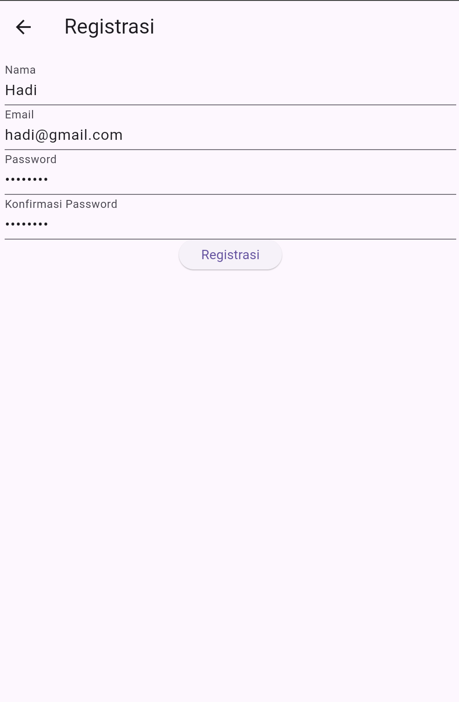
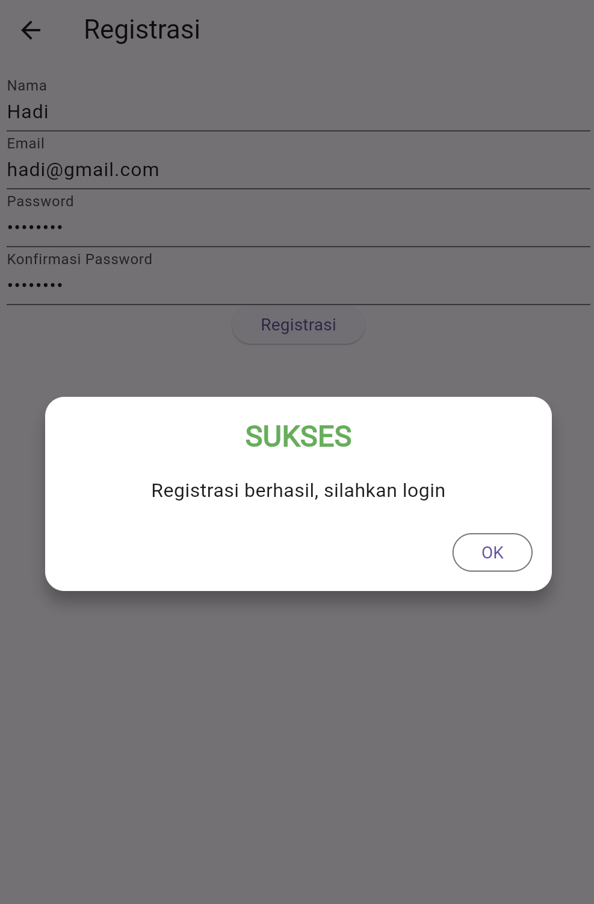
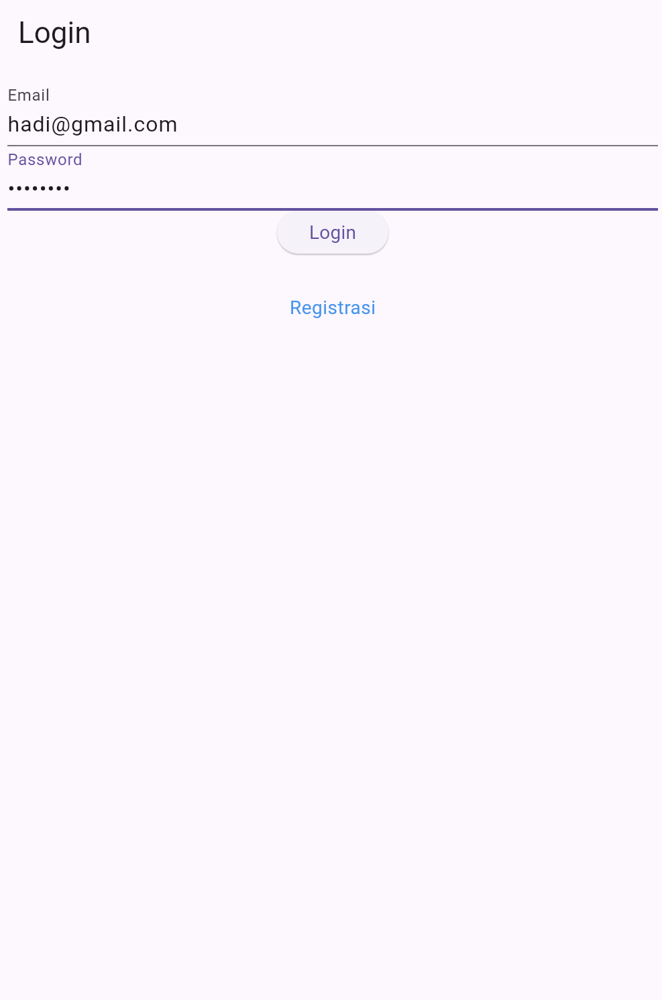
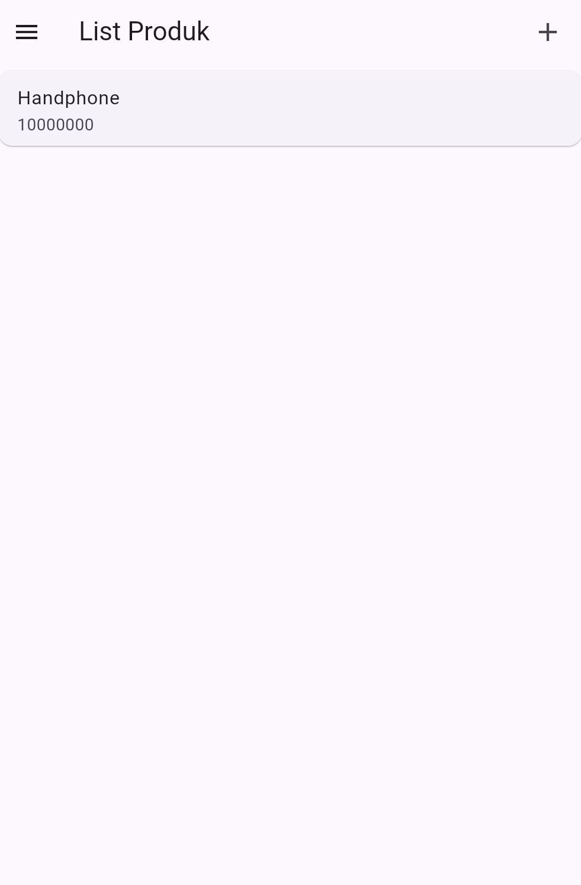
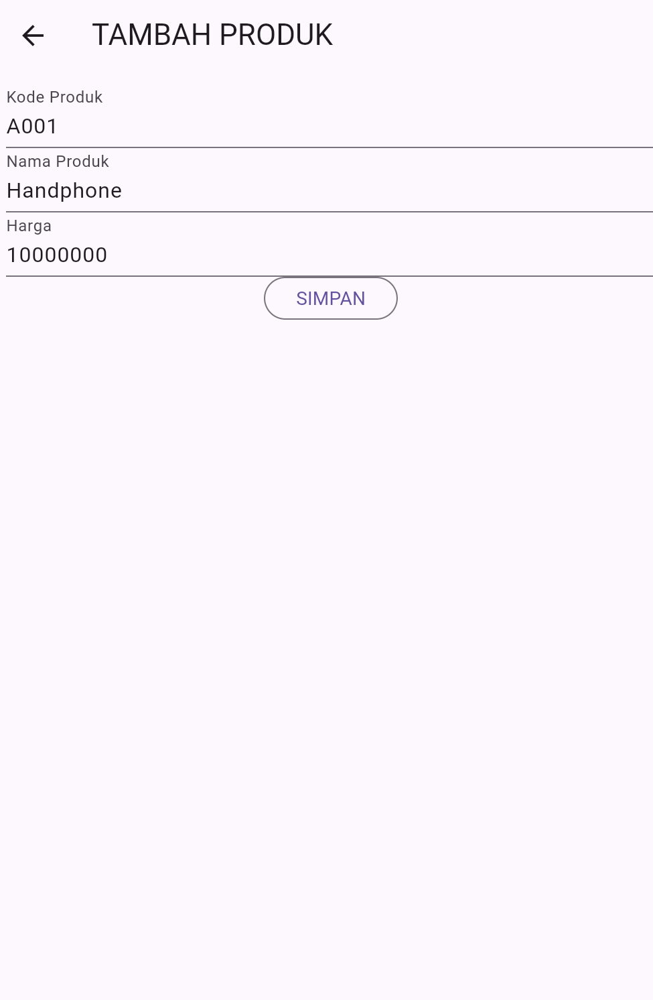
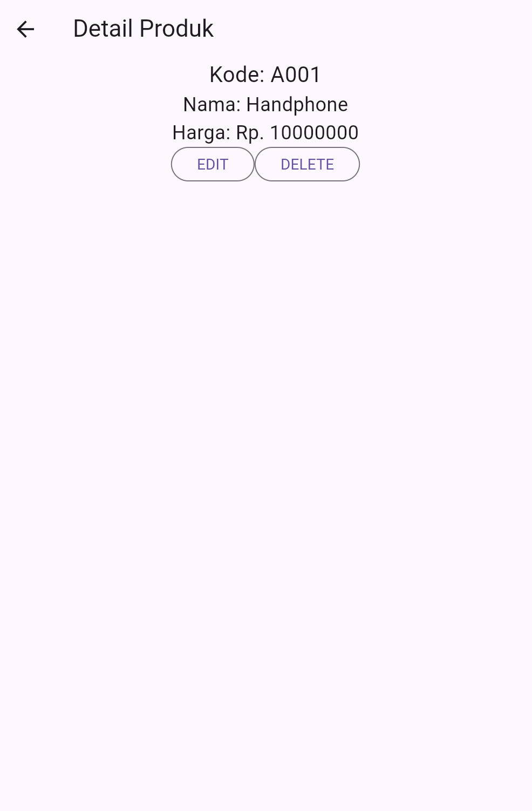
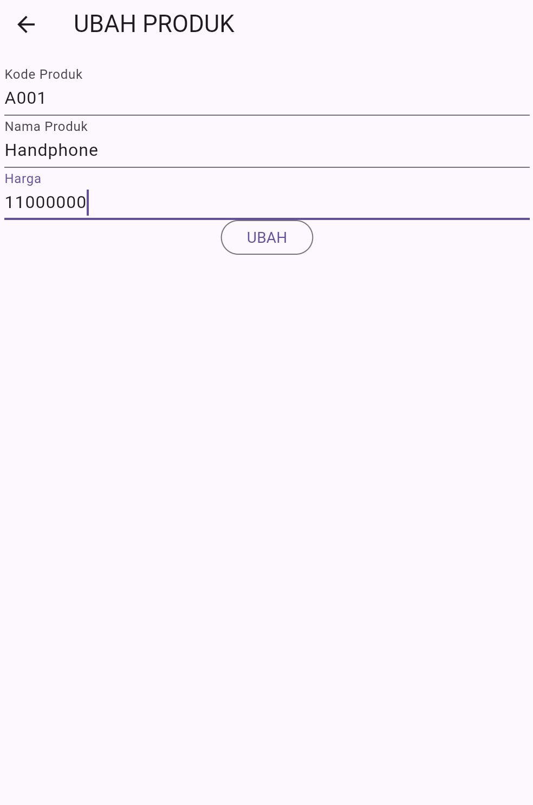
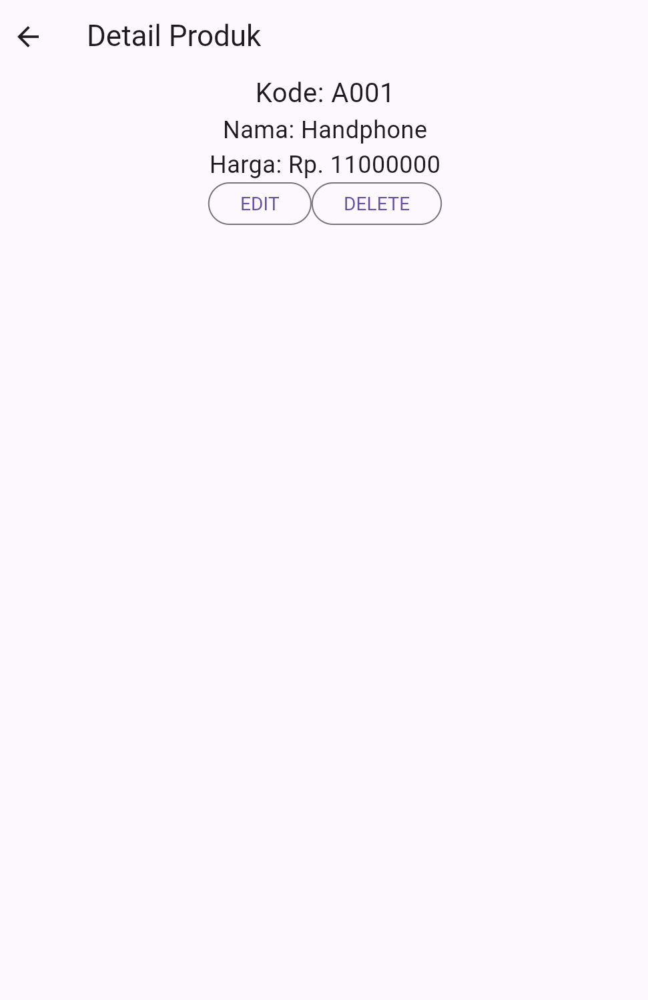
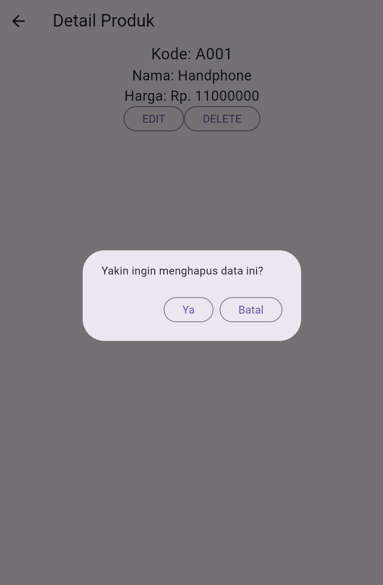

# Toko Kita - Aplikasi Manajemen Produk

**Nama:** Muhammad Nugrahhadi Al Khawarizmi  
**NIM:** H1D023055  
**Shift Awal:** G  
**Shift Saat Ini:** A  
**Tugas 9 Pertemuan 11**

## Deskripsi Proyek

Aplikasi Flutter untuk manajemen produk toko yang terintegrasi dengan REST API menggunakan CodeIgniter 4. Aplikasi ini memungkinkan pengguna untuk registrasi, login, dan melakukan operasi CRUD (Create, Read, Update, Delete) pada data produk.

## Fitur Aplikasi

- ✅ Registrasi pengguna baru
- ✅ Login dengan autentikasi menggunakan token
- ✅ Melihat daftar produk
- ✅ Menambah produk baru
- ✅ Melihat detail produk
- ✅ Mengubah data produk
- ✅ Menghapus produk

---

## Proses Registrasi

### a. Form Registrasi



**Penjelasan:**
Pengguna mengisi form registrasi dengan data:

- **Nama**: Nama lengkap pengguna
- **Email**: Email yang akan digunakan untuk login
- **Password**: Password minimal 6 karakter
- **Konfirmasi Password**: Harus sama dengan password

**Kode Form Registrasi** (`lib/ui/registrasi_page.dart`):

```dart
Widget _namaTextField() {
  return TextFormField(
    decoration: const InputDecoration(labelText: "Nama"),
    keyboardType: TextInputType.text,
    controller: _namaTextboxController,
    validator: (value) {
      if (value!.length < 3) {
        return "Nama harus diisi minimal 3 karakter";
      }
      return null;
    },
  );
}

Widget _emailTextField() {
  return TextFormField(
    decoration: const InputDecoration(labelText: "Email"),
    keyboardType: TextInputType.emailAddress,
    controller: _emailTextboxController,
    validator: (value) {
      if (value!.isEmpty) {
        return 'Email harus diisi';
      }
      Pattern pattern =
        r'^(([^<>()[\]\\.,;:\s@\"]+(\.[^<>()[\]\\.,;:\s@\"]+)*)|(\".+\"))@((\[[0-9]{1,3}\.[0-9]{1,3}\.[0-9]{1,3}\.[0-9]{1,3}\])|(([a-zA-Z\-0-9]+\.)+[a-zA-Z]{2,}))$';
      RegExp regex = RegExp(pattern.toString());
      if (!regex.hasMatch(value)) {
        return "Email tidak valid";
      }
      return null;
    },
  );
}

Widget _passwordTextField() {
  return TextFormField(
    decoration: const InputDecoration(labelText: "Password"),
    keyboardType: TextInputType.text,
    obscureText: true,
    controller: _passwordTextboxController,
    validator: (value) {
      if (value!.length < 6) {
        return "Password harus diisi minimal 6 karakter";
      }
      return null;
    },
  );
}

Widget _passwordKonfirmasiTextField() {
  return TextFormField(
    decoration: const InputDecoration(labelText: "Konfirmasi Password"),
    keyboardType: TextInputType.text,
    obscureText: true,
    validator: (value) {
      if (value != _passwordTextboxController.text) {
        return "Konfirmasi Password tidak sama";
      }
      return null;
    },
  );
}
```

**Proses Submit Registrasi**:

```dart
void _submit() {
  _formKey.currentState!.save();
  setState(() {
    _isLoading = true;
  });

  RegistrasiBloc.registrasi(
    nama: _namaTextboxController.text,
    email: _emailTextboxController.text,
    password: _passwordTextboxController.text
  ).then((value) {
    showDialog(
      context: context,
      barrierDismissible: false,
      builder: (BuildContext context) => SuccessDialog(
        description: "Registrasi berhasil, silahkan login",
        okClick: () {
          Navigator.pop(context);
        },
      )
    );
  }, onError: (error) {
    showDialog(
      context: context,
      barrierDismissible: false,
      builder: (BuildContext context) => const WarningDialog(
        description: "Registrasi gagal, silahkan coba lagi",
      )
    );
  });

  setState(() {
    _isLoading = false;
  });
}
```

**API Call** (`lib/bloc/registrasi_bloc.dart`):

```dart
class RegistrasiBloc {
  static Future<Registrasi> registrasi({
    String? nama,
    String? email,
    String? password
  }) async {
    String apiUrl = ApiUrl.registrasi;
    var body = {
      "nama": nama,
      "email": email,
      "password": password
    };
    var response = await Api().post(apiUrl, body);
    var jsonObj = json.decode(response.body);
    return Registrasi.fromJson(jsonObj);
  }
}
```

### b. Popup Berhasil Registrasi



**Penjelasan:**
Setelah data registrasi berhasil dikirim ke server dan diproses, akan muncul popup dialog yang menginformasikan bahwa registrasi berhasil dan pengguna diminta untuk login.

**Kode Success Dialog** (`lib/widget/success_dialog.dart`):

```dart
class SuccessDialog extends StatelessWidget {
  final String? description;
  final VoidCallback? okClick;

  const SuccessDialog({Key? key, this.description, this.okClick})
      : super(key: key);

  @override
  Widget build(BuildContext context) {
    return AlertDialog(
      title: const Text("Sukses"),
      content: Text(description ?? "Operasi berhasil"),
      actions: [
        ElevatedButton(
          child: const Text("Ok"),
          onPressed: () {
            Navigator.pop(context);
            if (okClick != null) okClick!();
          },
        )
      ],
    );
  }
}
```

---

## Proses Login

### a. Form Login



**Penjelasan:**
Pengguna memasukkan email dan password yang telah didaftarkan sebelumnya. Sistem akan memvalidasi kredensial dengan memanggil API login.

**Kode Form Login** (`lib/ui/login_page.dart`):

```dart
Widget _emailTextField() {
  return TextFormField(
    decoration: const InputDecoration(labelText: "Email"),
    keyboardType: TextInputType.emailAddress,
    controller: _emailTextboxController,
    validator: (value) {
      if (value!.isEmpty) {
        return 'Email harus diisi';
      }
      return null;
    },
  );
}

Widget _passwordTextField() {
  return TextFormField(
    decoration: const InputDecoration(labelText: "Password"),
    keyboardType: TextInputType.text,
    obscureText: true,
    controller: _passwordTextboxController,
    validator: (value) {
      if (value!.isEmpty) {
        return "Password harus diisi";
      }
      return null;
    },
  );
}

Widget _buttonLogin() {
  return ElevatedButton(
    child: const Text("Login"),
    onPressed: () {
      var validate = _formKey.currentState!.validate();
      if(validate){
        if(!_isLoading) _submit();
      }
    }
  );
}
```

**Proses Submit Login**:

```dart
void _submit() {
  _formKey.currentState!.save();
  setState(() {
    _isLoading = true;
  });

  LoginBloc.login(
    email: _emailTextboxController.text,
    password: _passwordTextboxController.text
  ).then((value) async {
    if (value.code == 200) {
      // Simpan token dan user info
      await UserInfo().setToken(value.token!);
      await UserInfo().setUserID(value.userID!);

      Navigator.pushReplacement(
        context,
        MaterialPageRoute(builder: (context) => const ProdukPage())
      );
    } else {
      showDialog(
        context: context,
        barrierDismissible: false,
        builder: (BuildContext context) => const WarningDialog(
          description: "Login gagal, periksa email dan password",
        )
      );
    }
  }, onError: (error) {
    showDialog(
      context: context,
      barrierDismissible: false,
      builder: (BuildContext context) => const WarningDialog(
        description: "Login gagal, silahkan coba lagi",
      )
    );
  });

  setState(() {
    _isLoading = false;
  });
}
```

**API Call** (`lib/bloc/login_bloc.dart`):

```dart
class LoginBloc {
  static Future<Login> login({
    String? email,
    String? password
  }) async {
    String apiUrl = ApiUrl.login;
    var body = {
      "email": email,
      "password": password
    };
    var response = await Api().post(apiUrl, body);
    var jsonObj = json.decode(response.body);
    return Login.fromJson(jsonObj);
  }
}
```

**Model Login** (`lib/model/login.dart`):

```dart
class Login {
  int? code;
  bool? status;
  String? token;
  int? userID;
  String? userEmail;

  Login({this.code, this.status, this.token, this.userID, this.userEmail});

  factory Login.fromJson(Map<String, dynamic> obj) {
    if (obj['code'] == 200) {
      return Login(
        code: obj['code'],
        status: obj['status'],
        token: obj['data']['token'],
        userID: int.parse(obj['data']['user']['id']),
        userEmail: obj['data']['user']['email'],
      );
    } else {
      return Login(
        code: obj['code'],
        status: obj['status'],
      );
    }
  }
}
```

---

## Proses Melihat Daftar Produk (Read)

### List Produk



**Penjelasan:**
Setelah login berhasil, pengguna akan diarahkan ke halaman list produk. Halaman ini menampilkan semua produk yang ada di database dalam bentuk list. Setiap item produk dapat diklik untuk melihat detail.

**Kode List Produk** (`lib/ui/produk_page.dart`):

```dart
class ProdukPage extends StatefulWidget {
  const ProdukPage({Key? key}) : super(key: key);

  @override
  _ProdukPageState createState() => _ProdukPageState();
}

class _ProdukPageState extends State<ProdukPage> {
  @override
  Widget build(BuildContext context) {
    return Scaffold(
      appBar: AppBar(
        title: const Text('List Produk'),
        actions: [
          Padding(
            padding: const EdgeInsets.only(right: 20.0),
            child: GestureDetector(
              child: const Icon(Icons.add, size: 26.0),
              onTap: () async {
                Navigator.push(
                  context,
                  MaterialPageRoute(
                    builder: (context) => ProdukForm()
                  )
                );
              },
            )
          )
        ],
      ),
      drawer: Drawer(
        child: ListView(
          children: [
            ListTile(
              title: const Text('Logout'),
              trailing: const Icon(Icons.logout),
              onTap: () async {
                await LogoutBloc.logout().then((value) => {
                  Navigator.of(context).pushAndRemoveUntil(
                    MaterialPageRoute(
                      builder: (context) => LoginPage()
                    ),
                    (route) => false
                  )
                });
              },
            )
          ],
        ),
      ),
      body: FutureBuilder<List>(
        future: ProdukBloc.getProduks(),
        builder: (context, snapshot) {
          if (snapshot.hasError) print(snapshot.error);
          return snapshot.hasData
              ? ListProduk(list: snapshot.data)
              : const Center(child: CircularProgressIndicator());
        },
      ),
    );
  }
}

class ListProduk extends StatelessWidget {
  final List? list;
  const ListProduk({Key? key, this.list}) : super(key: key);

  @override
  Widget build(BuildContext context) {
    return ListView.builder(
      itemCount: list == null ? 0 : list!.length,
      itemBuilder: (context, i) {
        return ItemProduk(
          produk: list![i],
        );
      },
    );
  }
}

class ItemProduk extends StatelessWidget {
  final Produk produk;
  const ItemProduk({Key? key, required this.produk}) : super(key: key);

  @override
  Widget build(BuildContext context) {
    return GestureDetector(
      onTap: () {
        Navigator.push(
          context,
          MaterialPageRoute(
            builder: (context) => ProdukDetail(produk: produk)
          )
        );
      },
      child: Card(
        child: ListTile(
          title: Text(produk.namaProduk!),
          subtitle: Text('Rp. ${produk.hargaProduk.toString()}'),
          trailing: Text(produk.kodeProduk!),
        ),
      ),
    );
  }
}
```

**API Call** (`lib/bloc/produk_bloc.dart`):

```dart
static Future<List<Produk>> getProduks() async {
  String apiUrl = ApiUrl.listProduk;
  var response = await Api().get(apiUrl);
  var jsonObj = json.decode(response.body);
  List<dynamic> listProduk = (jsonObj as Map<String, dynamic>)['data'];
  List<Produk> produks = [];
  for (int i = 0; i < listProduk.length; i++) {
    produks.add(Produk.fromJson(listProduk[i]));
  }
  return produks;
}
```

---

## Proses Tambah Produk (Create)

### a. Form Tambah Produk



**Penjelasan:**
Pengguna mengisi form untuk menambah produk baru dengan data:

- **Kode Produk**: Kode unik produk
- **Nama Produk**: Nama produk
- **Harga Produk**: Harga dalam rupiah

**Kode Form Tambah Produk** (`lib/ui/produk_form.dart`):

```dart
class ProdukForm extends StatefulWidget {
  final Produk? produk;
  const ProdukForm({Key? key, this.produk}) : super(key: key);

  @override
  _ProdukFormState createState() => _ProdukFormState();
}

class _ProdukFormState extends State<ProdukForm> {
  final _formKey = GlobalKey<FormState>();
  bool _isLoading = false;
  String judul = "TAMBAH PRODUK";
  String tombolSubmit = "SIMPAN";

  final _kodeProdukTextboxController = TextEditingController();
  final _namaProdukTextboxController = TextEditingController();
  final _hargaProdukTextboxController = TextEditingController();

  @override
  void initState() {
    super.initState();
    isUpdate();
  }

  isUpdate() {
    if (widget.produk != null) {
      setState(() {
        judul = "UBAH PRODUK";
        tombolSubmit = "UBAH";
        _kodeProdukTextboxController.text = widget.produk!.kodeProduk!;
        _namaProdukTextboxController.text = widget.produk!.namaProduk!;
        _hargaProdukTextboxController.text =
          widget.produk!.hargaProduk.toString();
      });
    } else {
      judul = "TAMBAH PRODUK";
      tombolSubmit = "SIMPAN";
    }
  }

  Widget _kodeProdukTextField() {
    return TextFormField(
      decoration: const InputDecoration(labelText: "Kode Produk"),
      keyboardType: TextInputType.text,
      controller: _kodeProdukTextboxController,
      validator: (value) {
        if (value!.isEmpty) {
          return "Kode Produk harus diisi";
        }
        return null;
      },
    );
  }

  Widget _namaProdukTextField() {
    return TextFormField(
      decoration: const InputDecoration(labelText: "Nama Produk"),
      keyboardType: TextInputType.text,
      controller: _namaProdukTextboxController,
      validator: (value) {
        if (value!.isEmpty) {
          return "Nama Produk harus diisi";
        }
        return null;
      },
    );
  }

  Widget _hargaProdukTextField() {
    return TextFormField(
      decoration: const InputDecoration(labelText: "Harga"),
      keyboardType: TextInputType.number,
      controller: _hargaProdukTextboxController,
      validator: (value) {
        if (value!.isEmpty) {
          return "Harga harus diisi";
        }
        return null;
      },
    );
  }

  Widget _buttonSubmit() {
    return ElevatedButton(
      child: Text(tombolSubmit),
      onPressed: () {
        var validate = _formKey.currentState!.validate();
        if (validate) {
          if (!_isLoading) {
            if (widget.produk != null) {
              ubah();
            } else {
              simpan();
            }
          }
        }
      }
    );
  }
}
```

**Proses Simpan Produk**:

```dart
void simpan() {
  setState(() {
    _isLoading = true;
  });

  Produk createProduk = Produk(id: null);
  createProduk.kodeProduk = _kodeProdukTextboxController.text;
  createProduk.namaProduk = _namaProdukTextboxController.text;
  createProduk.hargaProduk = int.parse(_hargaProdukTextboxController.text);

  ProdukBloc.addProduk(produk: createProduk).then((value) {
    Navigator.of(context).push(
      MaterialPageRoute(
        builder: (BuildContext context) => const ProdukPage()
      )
    );
  }, onError: (error) {
    showDialog(
      context: context,
      builder: (BuildContext context) => const WarningDialog(
        description: "Simpan gagal, silahkan coba lagi",
      )
    );
  });

  setState(() {
    _isLoading = false;
  });
}
```

**API Call** (`lib/bloc/produk_bloc.dart`):

```dart
static Future addProduk({Produk? produk}) async {
  String apiUrl = ApiUrl.createProduk;
  var body = {
    "kode_produk": produk!.kodeProduk,
    "nama_produk": produk.namaProduk,
    "harga": produk.hargaProduk.toString()
  };
  var response = await Api().post(apiUrl, body);
  var jsonObj = json.decode(response.body);
  return jsonObj['status'];
}
```

---

## Proses Lihat Detail Produk (Read Detail)

### Detail Produk



**Penjelasan:**
Halaman ini menampilkan informasi detail dari produk yang dipilih, termasuk kode produk, nama produk, dan harga. Tersedia tombol untuk mengedit dan menghapus produk.

**Kode Detail Produk** (`lib/ui/produk_detail.dart`):

```dart
class ProdukDetail extends StatefulWidget {
  final Produk? produk;
  const ProdukDetail({Key? key, this.produk}) : super(key: key);

  @override
  _ProdukDetailState createState() => _ProdukDetailState();
}

class _ProdukDetailState extends State<ProdukDetail> {
  @override
  Widget build(BuildContext context) {
    return Scaffold(
      appBar: AppBar(
        title: const Text('Detail Produk'),
      ),
      body: Center(
        child: Column(
          children: [
            Text(
              "Kode: ${widget.produk!.kodeProduk}",
              style: const TextStyle(fontSize: 20.0),
            ),
            Text(
              "Nama: ${widget.produk!.namaProduk}",
              style: const TextStyle(fontSize: 18.0),
            ),
            Text(
              "Harga: Rp. ${widget.produk!.hargaProduk.toString()}",
              style: const TextStyle(fontSize: 18.0),
            ),
            _tombolHapusEdit()
          ],
        ),
      ),
    );
  }

  Widget _tombolHapusEdit() {
    return Row(
      mainAxisSize: MainAxisSize.min,
      children: [
        // Tombol Edit
        OutlinedButton(
          child: const Text("EDIT"),
          onPressed: () {
            Navigator.push(
              context,
              MaterialPageRoute(
                builder: (context) => ProdukForm(
                  produk: widget.produk!,
                )
              )
            );
          },
        ),
        // Tombol Hapus
        OutlinedButton(
          child: const Text("DELETE"),
          onPressed: () => confirmHapus(),
        ),
      ],
    );
  }

  void confirmHapus() {
    AlertDialog alertDialog = AlertDialog(
      content: const Text("Yakin ingin menghapus data ini?"),
      actions: [
        OutlinedButton(
          child: const Text("Ya"),
          onPressed: () {
            ProdukBloc.deleteProduk(id: int.parse(widget.produk!.id!))
              .then((value) => {
                Navigator.of(context).push(
                  MaterialPageRoute(
                    builder: (context) => const ProdukPage()
                  )
                )
              }, onError: (error) {
                showDialog(
                  context: context,
                  builder: (BuildContext context) => const WarningDialog(
                    description: "Hapus gagal, silahkan coba lagi",
                  )
                );
              });
          },
        ),
        OutlinedButton(
          child: const Text("Batal"),
          onPressed: () => Navigator.pop(context),
        )
      ],
    );
    showDialog(builder: (context) => alertDialog, context: context);
  }
}
```

---

## Proses Edit Produk (Update)

### a. Form Edit Produk



**Penjelasan:**
Form yang sama dengan tambah produk, tetapi field-field sudah terisi dengan data produk yang akan diubah. Pengguna dapat mengubah kode produk, nama produk, atau harga.

**Proses Update Produk**:

```dart
void ubah() {
  setState(() {
    _isLoading = true;
  });

  Produk updateProduk = Produk(id: widget.produk!.id!);
  updateProduk.kodeProduk = _kodeProdukTextboxController.text;
  updateProduk.namaProduk = _namaProdukTextboxController.text;
  updateProduk.hargaProduk = int.parse(_hargaProdukTextboxController.text);

  ProdukBloc.updateProduk(produk: updateProduk).then((value) {
    Navigator.of(context).push(
      MaterialPageRoute(
        builder: (BuildContext context) => const ProdukPage()
      )
    );
  }, onError: (error) {
    showDialog(
      context: context,
      builder: (BuildContext context) => const WarningDialog(
        description: "Permintaan ubah data gagal, silahkan coba lagi",
      )
    );
  });

  setState(() {
    _isLoading = false;
  });
}
```

**API Call** (`lib/bloc/produk_bloc.dart`):

```dart
static Future updateProduk({required Produk produk}) async {
  String apiUrl = ApiUrl.updateProduk(int.parse(produk.id!));
  var body = {
    "kode_produk": produk.kodeProduk,
    "nama_produk": produk.namaProduk,
    "harga": produk.hargaProduk.toString()
  };
  var response = await Api().put(apiUrl, jsonEncode(body));
  var jsonObj = json.decode(response.body);
  return jsonObj['status'];
}
```

### b. Detail Produk Setelah Edit



**Penjelasan:**
Setelah proses edit berhasil, pengguna dapat melihat detail produk yang sudah diperbarui dengan data yang baru.

---

## Proses Hapus Produk (Delete)

### Konfirmasi Hapus Produk



**Penjelasan:**
Sebelum menghapus produk, sistem akan menampilkan dialog konfirmasi untuk memastikan pengguna benar-benar ingin menghapus data tersebut. Jika pengguna memilih "Ya", data akan dihapus dari database.

**Kode Hapus Produk**:

```dart
void confirmHapus() {
  AlertDialog alertDialog = AlertDialog(
    content: const Text("Yakin ingin menghapus data ini?"),
    actions: [
      // Tombol Ya
      OutlinedButton(
        child: const Text("Ya"),
        onPressed: () {
          ProdukBloc.deleteProduk(id: int.parse(widget.produk!.id!))
            .then((value) => {
              Navigator.of(context).push(
                MaterialPageRoute(
                  builder: (context) => const ProdukPage()
                )
              )
            }, onError: (error) {
              showDialog(
                context: context,
                builder: (BuildContext context) => const WarningDialog(
                  description: "Hapus gagal, silahkan coba lagi",
                )
              );
            });
        },
      ),
      // Tombol Batal
      OutlinedButton(
        child: const Text("Batal"),
        onPressed: () => Navigator.pop(context),
      )
    ],
  );
  showDialog(builder: (context) => alertDialog, context: context);
}
```

**API Call** (`lib/bloc/produk_bloc.dart`):

```dart
static Future<bool> deleteProduk({int? id}) async {
  String apiUrl = ApiUrl.deleteProduk(id!);
  var response = await Api().delete(apiUrl);
  var jsonObj = json.decode(response.body);
  return (jsonObj as Map<String, dynamic>)['data'];
}
```

---

## Konfigurasi API

### API URL (`lib/helpers/api_url.dart`):

```dart
class ApiUrl {
  static const String baseUrl = 'http://localhost:8080';
  static const String registrasi = baseUrl + '/registrasi';
  static const String login = baseUrl + '/login';
  static const String listProduk = baseUrl + '/produk';
  static const String createProduk = baseUrl + '/produk';

  static String updateProduk(int id) {
    return baseUrl + '/produk/' + id.toString();
  }

  static String showProduk(int id) {
    return baseUrl + '/produk/' + id.toString();
  }

  static String deleteProduk(int id) {
    return baseUrl + '/produk/' + id.toString();
  }
}
```

### API Helper (`lib/helpers/api.dart`):

```dart
class Api {
  Future<dynamic> post(dynamic url, dynamic data) async {
    var token = await UserInfo().getToken();
    var responseJson;

    try {
      final response = await http.post(
        Uri.parse(url),
        body: jsonEncode(data),
        headers: {
          HttpHeaders.authorizationHeader: "Bearer $token",
          HttpHeaders.contentTypeHeader: "application/json"
        }
      );
      responseJson = _returnResponse(response);
    } on SocketException {
      throw FetchDataException('No Internet connection');
    }
    return responseJson;
  }

  Future<dynamic> get(dynamic url) async {
    var token = await UserInfo().getToken();
    var responseJson;

    try {
      final response = await http.get(
        Uri.parse(url),
        headers: {
          HttpHeaders.authorizationHeader: "Bearer $token"
        }
      );
      responseJson = _returnResponse(response);
    } on SocketException {
      throw FetchDataException('No Internet connection');
    }
    return responseJson;
  }

  Future<dynamic> put(dynamic url, dynamic data) async {
    var token = await UserInfo().getToken();
    var responseJson;

    try {
      final response = await http.put(
        Uri.parse(url),
        body: data,
        headers: {
          HttpHeaders.authorizationHeader: "Bearer $token",
          HttpHeaders.contentTypeHeader: "application/json"
        }
      );
      responseJson = _returnResponse(response);
    } on SocketException {
      throw FetchDataException('No Internet connection');
    }
    return responseJson;
  }

  Future<dynamic> delete(dynamic url) async {
    var token = await UserInfo().getToken();
    var responseJson;

    try {
      final response = await http.delete(
        Uri.parse(url),
        headers: {
          HttpHeaders.authorizationHeader: "Bearer $token"
        }
      );
      responseJson = _returnResponse(response);
    } on SocketException {
      throw FetchDataException('No Internet connection');
    }
    return responseJson;
  }
}
```

---

## Cara Menjalankan Aplikasi

### 1. Persiapan Backend (Server CodeIgniter)

#### Install Dependencies

```bash
cd C:\laragon\www\toko-api
composer install
```

#### Setup Database

1. Buat database baru di MySQL (misal: `toko_db`)
2. Import file SQL atau jalankan migration
3. Update file `.env` dengan konfigurasi database:

```env
database.default.hostname = localhost
database.default.database = toko_db
database.default.username = root
database.default.password =
database.default.DBDriver = MySQLi
```

#### Jalankan Server

```bash
php spark serve --host=0.0.0.0 --port=8080
```

Server akan running di: `http://0.0.0.0:8080`

### 2. Persiapan Frontend (Flutter)

#### Install Dependencies

```bash
cd C:\Users\ngadii\Documents\PROJEK WEBSITE\tokokita
flutter pub get
```

#### Konfigurasi URL API

Edit file `lib/helpers/api_url.dart`:

**Untuk Web (Chrome):**

```dart
static const String baseUrl = 'http://localhost:8080';
```

**Untuk Android Emulator:**

```dart
static const String baseUrl = 'http://10.0.2.2:8080';
```

**Untuk Real Device:**

```dart
static const String baseUrl = 'http://192.168.x.x:8080'; // Ganti dengan IP komputer
```

#### Jalankan Aplikasi

**Untuk Web (Chrome):**

```bash
flutter run -d chrome --web-browser-flag "--disable-web-security"
```

**Untuk Android Emulator:**

```bash
flutter run -d <device-id>
```

**Lihat daftar device:**

```bash
flutter devices
```

### 3. Login Credentials

**Default Admin:**

- Email: `admin@tokokita.com`
- Password: `admin123`

Atau registrasi akun baru terlebih dahulu.

---

## Dependencies

### pubspec.yaml

```yaml
name: tokokita
description: "A new Flutter project."
publish_to: "none"
version: 1.0.0+1

environment:
  sdk: ^3.9.2

dependencies:
  flutter:
    sdk: flutter
  cupertino_icons: ^1.0.8
  shared_preferences: ^2.5.3
  http: ^1.1.0

dev_dependencies:
  flutter_test:
    sdk: flutter
  flutter_lints: ^5.0.0
```

### Packages yang Digunakan

| Package              | Versi  | Fungsi                                     |
| -------------------- | ------ | ------------------------------------------ |
| `shared_preferences` | ^2.5.3 | Menyimpan token dan data user secara lokal |
| `http`               | ^1.1.0 | Melakukan HTTP request ke REST API         |
| `cupertino_icons`    | ^1.0.8 | Icon iOS style                             |

---

## Struktur Project

```
lib/
├── bloc/
│   ├── login_bloc.dart           # Business logic untuk login
│   ├── logout_bloc.dart          # Business logic untuk logout
│   ├── produk_bloc.dart          # Business logic untuk CRUD produk
│   └── registrasi_bloc.dart      # Business logic untuk registrasi
├── helpers/
│   ├── api.dart                  # Helper untuk HTTP request
│   ├── api_url.dart              # Konfigurasi URL endpoint
│   ├── app_exception.dart        # Custom exception handling
│   └── user_info.dart            # Helper untuk manage user session
├── model/
│   ├── login.dart                # Model data login
│   ├── produk.dart               # Model data produk
│   └── registrasi.dart           # Model data registrasi
├── ui/
│   ├── login_page.dart           # Halaman login
│   ├── produk_detail.dart        # Halaman detail produk
│   ├── produk_form.dart          # Halaman form tambah/edit produk
│   ├── produk_page.dart          # Halaman list produk
│   └── registrasi_page.dart      # Halaman registrasi
├── widget/
│   ├── success_dialog.dart       # Widget dialog sukses
│   └── warning_dialog.dart       # Widget dialog warning/error
└── main.dart                     # Entry point aplikasi
```

---

## Arsitektur Aplikasi

Aplikasi ini menggunakan **BLoC Pattern** (Business Logic Component):

```
UI Layer (View)
     ↓
BLoC Layer (Business Logic)
     ↓
Model Layer (Data)
     ↓
API Layer (Network)
```

### Alur Data:

1. **User Input** → UI menangkap input dari user
2. **UI → BLoC** → UI memanggil method di BLoC
3. **BLoC → API** → BLoC melakukan HTTP request via API helper
4. **API → Server** → Request dikirim ke REST API server
5. **Server → API** → Response dari server diterima
6. **API → BLoC** → Response di-parse menjadi model
7. **BLoC → UI** → BLoC mengembalikan data ke UI
8. **UI Update** → UI di-render dengan data baru

### Teknologi yang Digunakan:

- **Frontend**: Flutter (Dart)
- **Backend**: CodeIgniter 4 (PHP)
- **Database**: MySQL
- **Authentication**: JWT (JSON Web Token)
- **State Management**: StatefulWidget
- **Pattern**: BLoC Pattern
- **HTTP Client**: package:http

### Referensi:

- [Flutter Documentation](https://docs.flutter.dev/)
- [CodeIgniter 4 Documentation](https://codeigniter.com/user_guide/)
- [REST API Best Practices](https://restfulapi.net/)

---

## Kontributor

**Muhammad Nugrahhadi Al Khawarizmi**  
NIM: H1D023055  
Shift: A (sebelumnya G)  
Universitas Jenderal Soedirman

---

## Lisensi

Proyek ini dibuat untuk keperluan tugas kuliah Praktikum Pemrograman Mobile.

---

**© 2025 - Toko Kita App**
